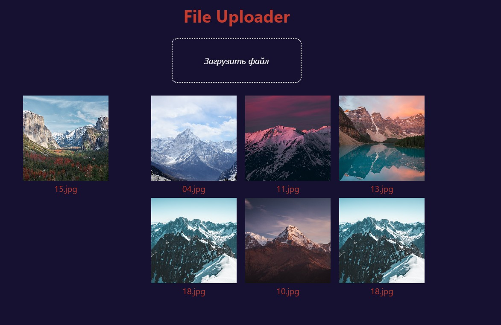

# Страница с фактами о Star Wars

Учебный проект курса [React для JS-разработчиков](https://netology.ru/programs/react)

## **Задача**

Разработка отображения фото профиля пользователя на базе Redux Toolkit.

## **Описание проекта**

1. Пользователю дана возможность загрузить фото в профиль.
2. После загрузки фото отображается в размере 200px*200px.
3. После загрузки изображения поле добавления фото не удаляется.
4. Можно загружать неограниченное количество изображений. При загрузке следующего изображения слева отображается последнее загруженное фото, остальные — справа.

Это проект не предполагает взаимодействия по протоколу HTTP и наличия серверной части.
## **Стек технологий**

## [**Демо**](https://profile-photo.vercel.app/)
